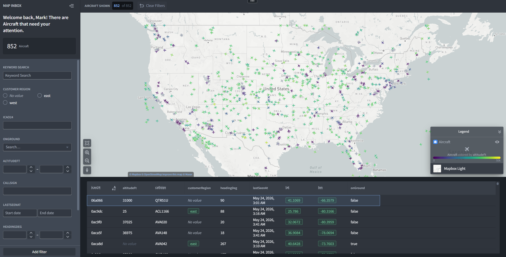
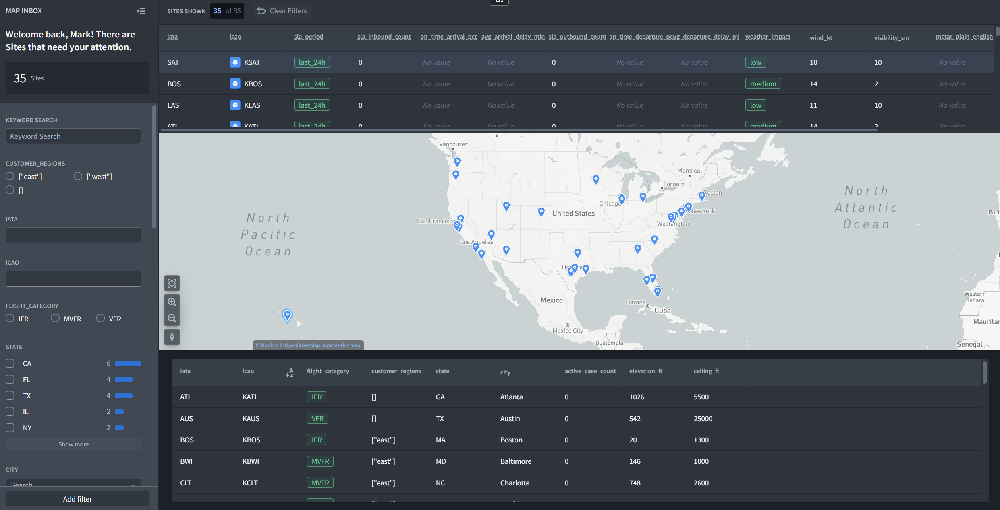
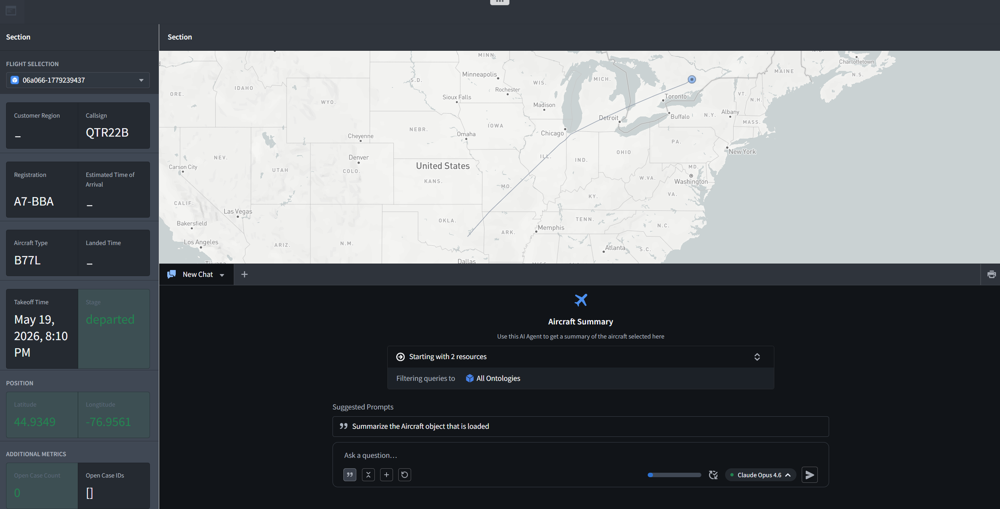
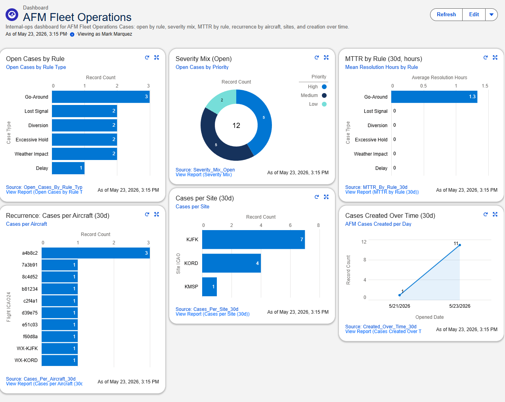

# Aerial Fleet Monitor

> Real-time fleet operations console — built on public US aviation data.

[](https://github.com/marky224/aerial-fleet-monitor/actions)
[](https://codecov.io/gh/marky224/aerial-fleet-monitor)
[](./LICENSE.md)

---

## What it is

AFM is a unified fleet operations console with a Salesforce-backed case management spine. It ingests live US aircraft positions and weather data, detects operational anomalies in real time, opens Salesforce Cases for each anomaly, and surfaces everything to internal advocates through region-scoped Foundry dashboards and a Salesforce Service Console.

The project demonstrates a fleet operations toolchain — telemetry visualization, anomaly detection, CRM-backed case management, and bidirectional sync between an operational data plane and a CRM plane.

## Architecture at a glance

```
┌─────────────────────────────────────────────────────────────────────────┐
│  Dashboard plane (Palantir Foundry)                                     │
│    Workshop apps: Fleet Overview · Site Drilldown · Flight Detail       │
│    Ontology: Aircraft · Flight · Site · Case                            │
│    AIP Logic: Aircraft summary widget on Flight Detail                  │
└─────────────────────────────────────────────────────────────────────────┘
                                  ▲
                                  │ Foundry sync (Dagster assets)
                                  │
┌─────────────────────────────────────────────────────────────────────────┐
│  Data plane (self-hosted Linux, public API via reverse tunnel)          │
│    FastAPI  ←→  Postgres 16  ←→  Parquet lakehouse (DuckDB)             │
│    Dagster orchestration: 14 assets across ingest, detection, sync      │
└─────────────────────────────────────────────────────────────────────────┘
                                  │ REST + OAuth (Client Credentials)
                                  ▼
┌─────────────────────────────────────────────────────────────────────────┐
│  CRM plane (Salesforce Agentforce Developer Edition)                    │
│    Custom objects: AFM_Site__c, AFM_Flight__c                           │
│    Case extensions: 13 custom fields, 4 Quick Actions, 6 reports        │
│    Service Console app + AFM Fleet Operations dashboard                 │
│    Permission Sets: internal-ops + region-scoped (East/West)            │
└─────────────────────────────────────────────────────────────────────────┘
                                  ▲
                                  │
                    ┌─────────────────────────────┐
                    │  External data sources      │
                    │  • OpenSky Network (ADS-B)  │
                    │  • NOAA AWC (METAR/TAF)     │
                    └─────────────────────────────┘
```

## What's working today

### Foundry Workshop dashboard

Three region-scoped Workshop apps bound to a custom Ontology (Aircraft, Flight, Site, Case). All three are populated by Dagster sync assets that read AFM's `/v1/` API and write to Foundry objects on schedule.

#### App 1 — Fleet Overview

Map view of all live aircraft positions (currently ~850 concurrent in the demo tenant), filtered by region, site, flight category, state, operator, callsign, and date range. Aircraft are color-coded by altitude. The table below the map shows aircraft with active operational concerns.



#### App 2 — Site Drilldown

Site list (35 watched US airports) with inbound/outbound counts, on-time arrival/departure metrics, weather impact, and visibility. Filterable by region, IFR/VFR category, state, and city. Map shows site pins; table exposes per-site SLA columns.



#### App 3 — Flight Detail

Per-aircraft detail view with callsign, registration, aircraft type, position, altitude, takeoff/landed times, and the 2-hour trail rendered as a polyline on the map. The AIP Logic widget at the bottom takes a natural-language question and answers from the loaded Aircraft object only — its read scope is structurally bounded to prevent hallucination across the wider fleet.



### Salesforce Service Console

The AFM Fleet Operations dashboard (Service Console app) shows internal ops the operational shape of the case stream: open cases by rule, severity mix, mean resolution hours by rule, recurrence per aircraft, cases per site, and cases created over time. Six reports back the dashboard; four Quick Actions on the Case layout (Acknowledge, Escalate, Resolve, Hand Off) drive case lifecycle.



Cases sync bidirectionally between AFM and Salesforce via two Dagster assets (`sf_case_push`, `sf_case_sync`), keyed on `AFM_External_Id__c`. Closures in Salesforce flow back to AFM as `resolved` state.

### Data plane

- **FastAPI** with 17 endpoints under `/v1/` covering positions (live + SSE stream), flights (detail + trail + batch trail), sites (list + detail + SLA + inbound/outbound), case sync, and health.
- **Postgres 16** with 14 tables across `app.` (operational) and `ref.` (reference data) schemas, managed by Alembic.
- **DuckDB-over-Parquet lakehouse** for atomic position snapshots written by the ingestion asset.
- **Dagster orchestration** with 14 assets organized into ingestion (OpenSky positions @30s, NOAA weather @5m), detection (`case_detector`), flight enrichment, Salesforce sync (push + pull), Foundry sync (positions, sites, flights, cases, aircraft reconcile), and maintenance (TTL pruning, reference seeding).

### Salesforce metadata

- 2 custom objects (`AFM_Site__c`, `AFM_Flight__c`)
- 13 custom fields on Case (type, region, external ID, flight/site links, severity badge + justification, detection facts, resolution hours, runbook refs, internal URL)
- 4 Quick Actions, 6 reports, 1 dashboard, 6 list views, 2 validation rules, 1 Path Assistant, 1 record type
- 4 Permission Sets (internal-ops console access, internal-ops admin, East customer, West customer)
- 3 Custom Permissions for region scoping
- 2 connected applications

All managed as SFDX source and deployed to an Agentforce Developer Edition org.

## Tech stack

**Dashboard:** Palantir Foundry (developer tier) · Workshop · Ontology · AIP Logic

**Backend:** FastAPI · Pydantic v2 · Postgres 16 · DuckDB over Parquet · Alembic · structlog

**Orchestration:** Dagster (asset-oriented, schedules, sensors)

**CRM:** Salesforce Agentforce Developer Edition · SFDX metadata · OAuth 2.0 Client Credentials

**Infrastructure:** Docker Compose on Ubuntu 24.04 · self-hosted reverse tunnel for public API · Foundry-hosted dashboard (no separate frontend hosting)

**Testing:** pytest · 9 API test modules · 15 pipelines test modules · 6 Foundry sync test modules · GitHub Actions CI

## Local development

```bash
git clone https://github.com/marky224/aerial-fleet-monitor.git
cd aerial-fleet-monitor

cp .env.example .env             # fill in API keys
make install                     # Python venvs
pre-commit install               # enable gitleaks pre-commit hook (requires `pipx install pre-commit`)
make db-migrate                  # Postgres schema
make db-seed                     # reference airport data

make dev                         # docker compose up -d (dashboard lives in Foundry)
```

Then:
- API: [http://localhost:8000/v1/docs](http://localhost:8000/v1/docs) (Swagger UI)
- Dagster: [http://localhost:3000](http://localhost:3000)
- Dashboard: Foundry workspace (separate developer-tier tenant; tenant URL in `_private/foundry/.env`)

For Salesforce integration: a separate Agentforce Developer Edition org is required.

Tests:
```bash
make test-unit           # ~30 seconds
make test-integration    # ~3 minutes (needs SF dev org credentials; auto-skipped without)
```

## Documentation

Detailed design docs (architecture, data model, API contracts, Salesforce setup, pipelines, dashboard / Foundry integration, runbooks, testing strategy) are maintained privately. Available on request for technical evaluation — `mark@markandrewmarquez.com`.

## License

This project is **proprietary** — all rights reserved. The repository is publicly visible for portfolio review and technical evaluation. You can read the code, clone it locally for evaluation, and reference it in conversations. You cannot use it commercially, deploy it as a service, redistribute it, or build derivative works.

## Contact

Mark Andrew Marquez · [markandrewmarquez.com](https://markandrewmarquez.com) · mark@markandrewmarquez.com

For commercial licensing inquiries, hiring conversations, or technical questions about the architecture, use the email above.

---

Built on public data. Designed to look like production. Architected to absorb the move to real fleet telemetry without redesign.
